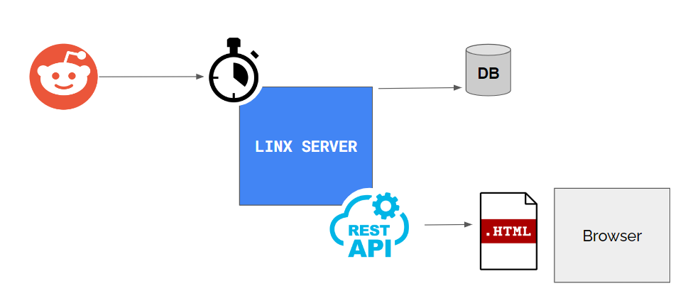

# CPT Low-Code Developer Day 2022

## Description
What a great event. This solution was built in the talk. Please feel free to download it. 

It follows the below logic:

## Installation
1. Run the SQL script provided to create the table
2. Change the connection string to your Database. (this is set in the settings)

For questions please ask the [Linx community](https://linx/software/community). You can get the Linx designer from [linx.software](https://linx.software/)

## License

[MIT](https://github.com/linx-software/template-repo/blob/main/LICENSE.txt)
